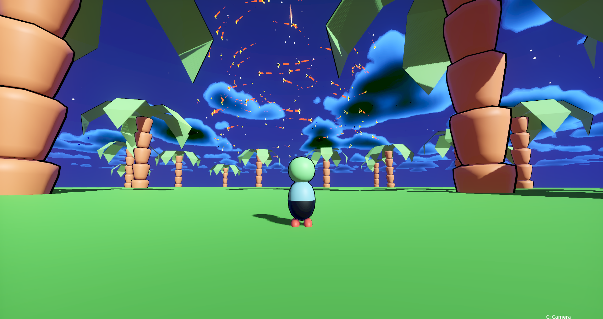

# Project Title

Name:
- Daniel Mendes
- Ho Chung
- Keith Railey Rumbaua

Student Number:
- C20489272
- C20348256
- C20463336

Class Group: TU858

# Description
This project is a simple flocking simulation game, where the birds will separate when they get too close, but try to get close to each other when they meet other birds for the first time, and they will move together while facing the same direction.

## Video:

## Google Drive (References):
https://drive.google.com/drive/folders/1oUlCEtrgKMn2k3R5RPPJNN846DZGdXq-?usp=sharing

## Screenshots

# Instructions
1. Run the project in Godot Engine
2. Press the keys W, A, S, D to move around the simulation environment
3. Press the space bar to jump
4. Use the mouse to change the camera angle and look around the simulation environment
5. Access the settings menu to change the player's attributes
6. Enjoy the simulation!

# How it works
To perform the flocking simulation, we need three main behaviors, alignment, cohesion, separation

Alignment: This behavior is used to make the entities face the same direction

- First, we get all of the birds units' velocities
- Second, we get the average of the velocity and multiply it with the MAX speed. To prevent it from going faster and faster, it is subtracted from their orignal velocity to reset their speed

Cohesion: This behavior will make the entities go slower to get closer together
- First, we get all the positions of the birds
- Second, we find the center position of the birds and normalize this result to get the direction

Separation: This behavior is used to make a birds try to move away from other birds
- We get the distance between the birds itself and other birds
- Finally, we get the average of the separation and normalize this result to get the velocity

At the end, we add these 3 results with the weight to get the final velocity

# List of classes/assets

| Class/asset | Source |
|-----------|-----------|
| Maps | Self made |
| Pigeon | Self made |
| UI | Self made |
| PlayerValues | Self written |
| EbbAndFlow | Self written |
| Spiral | Self written |
| Avoidance | From [reference](/GodotBoids/behaviors/Avoidance.gd) |
| Separation | From [reference](/GodotBoids/behaviors/Separation.gd) |
| Alignment | From [reference](/GodotBoids/behaviors/Alignment.gd) |
| Cohesion | From [reference](/GodotBoids/behaviors/Cohesion.gd) |
| Wander | From [reference](/GodotBoids/behaviors/Wander.gd) |
| Constrain | From [reference](/GodotBoids/behaviors/Constrain.gd) |

Each team member or individual needs to write a paragraph or two explaining what they contributed to the project

For this project, all of the team members participated on the development & implementation of the simulation, working on the coding aspect of the project through Discord, where we were able to hold coding sessions, to code multiple aspects simultaneously, helping each other when issues arise.

Words from:
- Daniel - While everyone participated in the development & code implementation, I designed the environment that the simulation takes place in as well as the UI that the player uses to navigate through the different settings of this simulation project.

- Ho Chung - While everyone participated in the development & code implementation, I came up with ideas for the new behaviour that we implemented to our creature in this project, as well as manage the project folder that we are building our simulation on.

- Keith -  While everyone participated in the development & code implementation, I also worked on the documentation of this project to make sure that it is up-to-date with the current version of our project, as well as provide some resources that my team members could use going forward with this project. I have learned a lot regarding behaviors of creatures & how they are replicated in a game engine for use for sectors such as games, animation & AI. I am most proud of the end product & the visual simulation of our chosen creature, as well as the work & effort that my team members have put into this project. I am very grateful to them.
